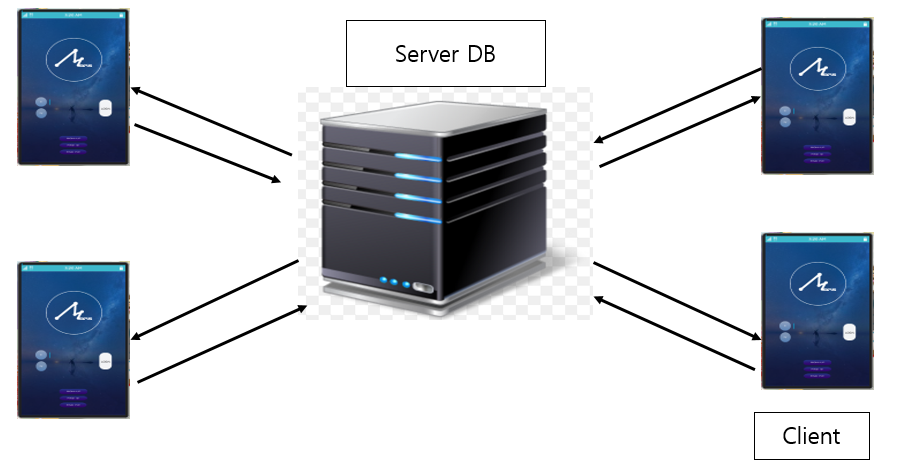
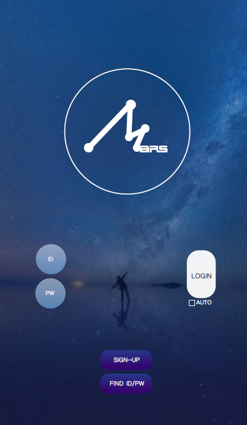
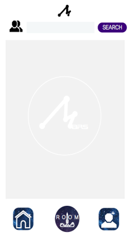

# TIZEN-Project-Chat-Application
Implement Chat application running on TIZEN OS

## 1. Project Overview 
+ ### Background 
  * 2016년 10월 현 시점 세계의 모바일 운영체제는 크게 안드로이드와 IOS에 의해서 양분화 되었고, 
  그 외에 타이젠, 파이어 폭스, 화에이 등의 기타 OS가 남은 지분을 차지하고 있는 상황입니다. 
  삼성은 최근 구글의 안드로이드가 수익 비율을 변경하고 자신들의 입지를 확고히 하려는 상황에서 
  IOS와 안드로이드에 대적하여 소프트웨어도 선도적인 회사임을 각인시키기 위해 타이젠 시장을 개발하고 있습니다. 
  하지만 이러한 삼성의 노력이 무색하게도, 현재 타이젠의 마켓에는 제대로 된 채팅 어플리케이션 조차 존재하지 않는 상황입니다.

+ ### Project Goal
  * 유저들과 채팅방을 만들어 대화할 수 있도록 한다. 
  * 친구추가, 방만들기 기능을 두어 기본적인 채팅 앱의 기능을 수행한다.

## 2. Development environment
+ ### Server
  * Windows 7
+ ### Client
  * Tizen 2.4
  * samsung Z3
  
## 3. Language/DB
+ ### Server
  * C++
  * MySQL ver 5.1.39
+ ### Client
  * Tizen C
  
## 4. Project Architecture & Design
+ ### Architecture
   
+ ### Design
   
   
   
## 5. Function Description
+ ### Main Function
  * 사람들과 메시지를 주고받는 채팅 기능
  * 새로운 친구를 추가하기 위한 친구 추가 기능
  * 다수의 친구들과 채팅을 위한 채팅방 만들기
  * 특정 사용자를 찾기 위한 친구 찾기 기능
  * 메신저를 이용하기 위한 회원가입 기능 
  * 사용자의 ID와 PW를 찾는 기능
+ ### Implementation method
  * 소켓을 이용한 서버와 클라이언트의 통신
  * 멀티 플렉싱 내의 멀티 프로세스를 이용한 효율적인 구조
  * 데이터베이스를 이용한 메시지 전달 
  * 데이터베이스를 이용한 사용자의 정보 관리 
  * 서버 내의 서버를 이용한 안정성 확보
  * 클라이언트에 최소의 기능을 구현하고 서버에 중점을 두어 프로그램의 가속성 추구 
  
## 6. Docs & Video
+ ### Docs
  * [Report](docs/Report.docx)
+ ### Video
  * [URL](https://www.youtube.com/watch?v=B9oF-xEzNqg&feature=youtu.be)
